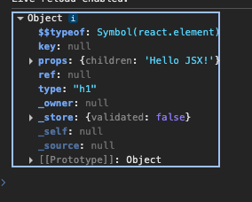
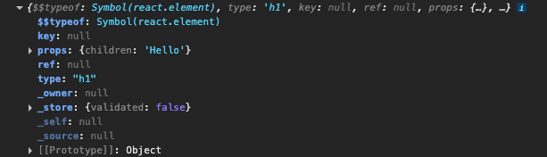
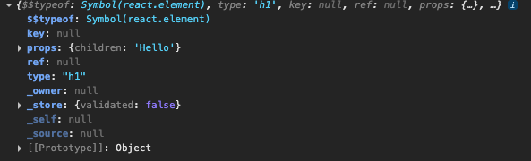

## step1.html

1. 과거 웹의 한계를 직접 체험하기

- refresh 버튼을 누르면은 브라우저가 실제 DOM 트리에서 id="title" 인 요소를 직접 탐색합니다.

- 해당 DON NODE를 수정하고 다시 렌더링(Reflow / Repaint) 을 수행

2. 위와 같은 렌더링 방식의 문제점

2-1) DOM 직접 탐색 비용 (비효율성)

- DOM 은 JS 객체가 아니라 브라우저가 관리하는 무거운 구조.
- 요소가 많아질수록 캄색 비용 증가

2-2) Reflow / Repaint가 잦아짐

- DOM 을 직접 수정하면 브라우저는 Reflow(레이아웃 계산), Repaint(다시 그리기) 를 수행한다.

2-3) UI 로직과 DOM 조작 로직이 섞여 있음

- “무엇을 보여줄지”와 “어떻게 DOM을 고칠지”가 한곳에 섞여 있어 코드가 커실수록 가독성 급락

2-4) 상태(화면을 결정하는 데이터)가 DOM 안에 있음

- 상태 추적, 재사용, 동기화, 테스트가 어려움

## step2.html

1. 브라우저가 JSX를 직접 이해하지 못한다는 사실을 확인한다.

- Uncaught SyntaxError: Unexpected token '<' 와 같은 오류가 발생한다. 이유는 <h1>Hello JSX!</h1> 와 같은 문법을 브라우저는 인식하지 못한다.

## step3.html

1.  Babel CDN를 추가하여 JSX 를 React가 인식할 수 있는 코드로 변환한다.

```JavaScript
    const element = <h1>Hello JSX!</h1>
     // babel에 의해  <h1>Hello JSX!</h1> 가 아래와 같이 변환이 된다. 즉, react 가 필요하게 된다.
    // const element = React.createElement("h1", null, "Hello JSX!");
```

2. React CDN를 추가하여 React가 컴퍼넌트, 상태, props 등을 처리하도록 한다.

```JavaScript
   <script
      crossorigin
      src="https://unpkg.com/react@18/umd/react.development.js"
    ></script>
```

- React의 핵심 라이브러리로 컴퍼넌트, 상태, props 등을 처리한다.

3. React DOM CDN 를 추가하여 DOM 에 붙인다.

```JavaScript
    <script
      crossorigin
      src="https://unpkg.com/react-dom@18/umd/react-dom.development.js"
    ></script>
```

- React를 브라우저 화면(DOM)에 붙이는 역할 (createRoot, render 제공)

4. <h1>Hello JSX!</h1>의 변화는 아래와 같다.
   

## step4.html

1. babel 이 실제로 어떤 코드로 바꾸는지 직접 확인해보기

```JavaScript
    const element = <h1>Hello</h1>;
    const element2 = React.createElement("h1", null, "Hello");
```

- 두 객체는 사실상 동일한 구조를 갖습니다.
- 즉 JSX는 단순히 React.createElement를 편하게 쓰기 위한 문법 설탕입니다





## step5.html

- “어떻게 할지” 대신 “무엇이 되어야 하는지”를 선언하는 React의 철학을 이해한다.

1. 명령형 방식(전통적 JS)

- 개발자가 모든 단계를 하나하나 지시함. 예를 들어, 버튼을 만들어라, 글자를 넣어라, 이벤트 연결해라 와 같이
- 컴퓨터에게 “어떻게 할지”를 직접 알려주는 방식, 그래서 명령형

2. 선언현 방식(React)

- 우리는 결과만 말함. “이 화면에는 이런 버튼이 있어야 해”라고 선언
- DOM 생성, 이벤트 연결 같은 과정은 React가 알아서 처리, 그래서 선언형
